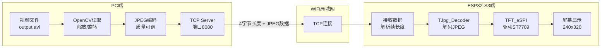

# ESP32-S3 WiFi 视频流播放器：从 PC 到屏幕的实时传输

> 使用 ESP32-S3 开发板通过 WiFi 接收 PC 端发送的 MJPEG 视频流，并实时显示在 ST7789 TFT 屏幕上。

---

## 📖 概述

本项目实现**低成本、易扩展的无线视频播放系统**。PC 作为视频服务器，读取本地 MJPEG 编码的 AVI 文件，通过 TCP Socket 将每一帧图像压缩为 JPEG 后发送；ESP32-S3 作为客户端，连接 WiFi 后接收数据，利用 `TJpg_Decoder` 库解码，并通过 `TFT_eSPI` 驱动 ST7789 屏幕实时显示。

系统特点：

- **端到端低延迟**：局域网内实测端到端延迟约 100~200ms
- **灵活的视频源**：支持任意分辨率、帧率的 MJPEG 视频，PC 端自动缩放旋转
- **断线自动重连**：ESP32 在网络波动后自动恢复连接
- **代码结构清晰**：PC 端 Python 脚本 + ESP32 Arduino 代码 + PlatformIO 配置，易于二次开发

---

## 🧱 系统架构图



---

## 1. ✨ 实现功能

### PC 端（Python 服务器）

| 功能 | 说明 |
|------|------|
| **视频读取** | 支持 MJPEG 编码的 AVI 文件，可循环播放 |
| **预处理** | 自动缩放至目标分辨率（如 320×240），支持旋转（0/90/180/270°） |
| **JPEG 压缩** | 可调质量（1~100），启用优化霍夫曼表减小体积 |
| **网络发送** | TCP Socket 发送每帧数据：4 字节长度（大端序）+ JPEG 数据 |
| **帧率控制** | 精确睡眠，保证发送帧率稳定（默认 12fps） |
| **统计日志** | 打印已发送帧数、帧大小、实际发送帧率 |

### ESP32-S3 端（Arduino 客户端）

| 功能 | 说明 |
|------|------|
| **WiFi 连接** | 连接指定 SSID 的热点，自动获取 IP |
| **TCP 客户端** | 连接 PC 服务器，接收视频流数据 |
| **数据解析** | 读取 4 字节长度，动态分配缓冲区，接收完整 JPEG 帧 |
| **JPEG 解码** | 使用 `TJpg_Decoder` 库，硬件加速解码 |
| **屏幕显示** | 通过 `TFT_eSPI` 库驱动 ST7789（240×320），支持旋转 |
| **断线重连** | 检测连接断开后自动重试 |

### 硬件平台

- **主控**：ESP32-S3（如 `ESP32-S3-DevKitC-1`）
- **屏幕**：ST7789 驱动，SPI 接口，分辨率 240×320
- **连接**：PC 开启移动热点，ESP32 连接该热点

---

## 2. 📄 代码本体

### 2.1 PC 端 Python 服务器 – `main.py`

```python
import cv2
import socket
import struct
import time
import sys
import logging
from collections import deque

# ========== 配置参数 ==========
HOST = '0.0.0.0'
PORT = 8080
VIDEO_FILE = 'output.avi'

# 目标显示参数（ESP32 屏幕分辨率）
TARGET_WIDTH = 320
TARGET_HEIGHT = 240
ROTATE = 0                         # 0:不转, 1:顺时针90°, 2:逆时针90°, 3:180°

JPEG_QUALITY = 80                  # 1~100
TARGET_FPS = 12
SEND_STATS_INTERVAL = 120

# ========== 初始化日志 ==========
logging.basicConfig(level=logging.INFO, format='%(asctime)s - %(message)s')
logger = logging.getLogger(__name__)

def preprocess_frame(frame, target_w, target_h, rotate):
    if rotate == 1:
        frame = cv2.rotate(frame, cv2.ROTATE_90_CLOCKWISE)
    elif rotate == 2:
        frame = cv2.rotate(frame, cv2.ROTATE_90_COUNTERCLOCKWISE)
    elif rotate == 3:
        frame = cv2.rotate(frame, cv2.ROTATE_180)
    if frame.shape[1] != target_w or frame.shape[0] != target_h:
        frame = cv2.resize(frame, (target_w, target_h), interpolation=cv2.INTER_LINEAR)
    return frame

def start_server():
    server_socket = socket.socket(socket.AF_INET, socket.SOCK_STREAM)
    server_socket.setsockopt(socket.SOL_SOCKET, socket.SO_REUSEADDR, 1)
    try:
        server_socket.bind((HOST, PORT))
    except Exception as e:
        logger.error(f"绑定端口失败: {e}")
        sys.exit(1)

    server_socket.listen(1)
    logger.info(f"服务器启动，监听端口 {PORT}，等待 ESP32 连接...")
    conn, addr = server_socket.accept()
    logger.info(f"ESP32 已连接，地址: {addr}")

    cap = cv2.VideoCapture(VIDEO_FILE)
    if not cap.isOpened():
        logger.error(f"无法打开视频文件 '{VIDEO_FILE}'")
        conn.close()
        server_socket.close()
        sys.exit(1)

    src_fps = cap.get(cv2.CAP_PROP_FPS)
    src_width = int(cap.get(cv2.CAP_PROP_FRAME_WIDTH))
    src_height = int(cap.get(cv2.CAP_PROP_FRAME_HEIGHT))
    logger.info(f"原始视频: {src_width}x{src_height}, {src_fps:.2f} fps")

    frame_interval = 1.0 / TARGET_FPS
    frame_count = 0
    send_times = deque(maxlen=30)

    try:
        while True:
            loop_start = time.perf_counter()
            ret, frame = cap.read()
            if not ret:
                cap.set(cv2.CAP_PROP_POS_FRAMES, 0)
                logger.debug("视频循环播放")
                continue

            frame = preprocess_frame(frame, TARGET_WIDTH, TARGET_HEIGHT, ROTATE)
            encode_param = [cv2.IMWRITE_JPEG_QUALITY, JPEG_QUALITY,
                            cv2.IMWRITE_JPEG_OPTIMIZE, 1]
            ret, jpeg_data = cv2.imencode('.jpg', frame, encode_param)
            if not ret:
                logger.warning("编码JPEG失败，跳过该帧")
                continue

            frame_size = len(jpeg_data)
            conn.sendall(struct.pack('>I', frame_size))
            conn.sendall(jpeg_data.tobytes())

            frame_count += 1
            send_times.append(time.perf_counter())

            if frame_count % SEND_STATS_INTERVAL == 0:
                if len(send_times) > 1:
                    elapsed = send_times[-1] - send_times[0]
                    actual_fps = (len(send_times) - 1) / elapsed if elapsed > 0 else 0
                else:
                    actual_fps = 0
                logger.info(f"已发送 {frame_count} 帧, 当前帧大小: {frame_size} 字节, "
                            f"实际发送帧率: {actual_fps:.2f} fps")

            elapsed = time.perf_counter() - loop_start
            sleep_time = frame_interval - elapsed
            if sleep_time > 0:
                time.sleep(sleep_time)

    except (BrokenPipeError, ConnectionResetError):
        logger.info("ESP32 连接已断开")
    except KeyboardInterrupt:
        logger.info("用户中断")
    finally:
        cap.release()
        conn.close()
        server_socket.close()
        logger.info("服务器关闭")

if __name__ == '__main__':
    start_server()
```

### 2.2 ESP32-S3 接收端 – `main.cpp`

```cpp
#include <Arduino.h>
#include <WiFi.h>
#include <TJpg_Decoder.h>
#include <TFT_eSPI.h>

// --- 网络配置 ---
const char* ssid = "Rolling";
const char* password = "0d000721";
const char* server_ip = "192.168.137.1";
const uint16_t server_port = 8080;

TFT_eSPI tft = TFT_eSPI();

WiFiClient client;
uint8_t* jpeg_buffer = nullptr;
uint32_t jpeg_buffer_size = 0;
uint32_t expected_frame_size = 0;
uint32_t bytes_received = 0;

// TFT_eSPI 显示JPEG图像的回调函数
bool tft_output(int16_t x, int16_t y, uint16_t w, uint16_t h, uint16_t* bitmap) {
    if (y >= tft.height()) return 0;
    tft.pushImage(x, y, w, h, bitmap);
    return 1;
}

void setup() {
    Serial.begin(9600);
    tft.begin();
    tft.setRotation(1);          // 旋转屏幕方向（0-3）
    tft.fillScreen(TFT_BLACK);

    // 配置TJpg_Decoder，指定绘图回调函数
    TJpgDec.setCallback(tft_output);

    // 连接WiFi
    WiFi.begin(ssid, password);
    while (WiFi.status() != WL_CONNECTED) {
        delay(500);
        Serial.print(".");
    }
    Serial.println("\nWiFi已连接，IP地址: " + WiFi.localIP().toString());
    // 连接服务器
    if (client.connect(server_ip, server_port)) {
        Serial.println("已连接到视频服务器");
    } else {
        Serial.println("连接服务器失败！");
    }
}

void loop() {
    if (!client.connected()) {
        Serial.println("与服务器的连接已断开，尝试重连...");
        if (client.connect(server_ip, server_port)) {
            Serial.println("重新连接成功");
        } else {
            delay(1000);
            return;
        }
    }

    // 读取并解析帧数据（4字节长度 + JPEG数据）
    while (client.available()) {
        if (expected_frame_size == 0) {
            if (client.available() < 4) break;
            uint8_t size_buf[4];
            client.readBytes(size_buf, 4);
            expected_frame_size = (size_buf[0] << 24) | (size_buf[1] << 16) | (size_buf[2] << 8) | size_buf[3];
            bytes_received = 0;

            if (expected_frame_size > jpeg_buffer_size) {
                if (jpeg_buffer) free(jpeg_buffer);
                jpeg_buffer = (uint8_t*)malloc(expected_frame_size);
                if (!jpeg_buffer) {
                    Serial.println("内存分配失败！");
                    expected_frame_size = 0;
                    return;
                }
                jpeg_buffer_size = expected_frame_size;
            }
        } else {
	    //读取图像数据
            uint32_t remaining = expected_frame_size - bytes_received;
            uint32_t to_read = client.available();
            if (to_read > remaining) to_read = remaining;
            client.readBytes(jpeg_buffer + bytes_received, to_read);
            bytes_received += to_read;
	    //一帧数据接收完成，进行解码与显示
            if (bytes_received == expected_frame_size) {
                TJpgDec.drawJpg(0, 0, jpeg_buffer, expected_frame_size);
                expected_frame_size = 0;    // 准备接收下一帧
            }
        }
    }
}
```

### 2.3 PlatformIO 配置文件 – `platformio.ini`

```ini
[env:esp32-s3-n16r8]
platform = espressif32
board = esp32-s3-devkitc-1
framework = arduino

; 容量配置
board_upload.flash_size = 16MB
board_upload.maximum_size = 16777216
board_build.partitions = default_16MB.csv

; 启用 PSRAM（可选，用于大帧缓冲区）
board_build.extra_flags = -DBOARD_HAS_PSRAM

; 库依赖
lib_deps = 
    bodmer/TFT_eSPI
    bodmer/TJpg_Decoder@^1.1.0

; TFT_eSPI 配置
build_flags = 
    -D USER_SETUP_LOADED=1
    -D ST7789_DRIVER
    -D TFT_WIDTH=240
    -D TFT_HEIGHT=320
    ; 引脚定义（根据实际接线修改）
    -D TFT_MOSI=11
    -D TFT_MISO=-1
    -D TFT_SCLK=12
    -D TFT_CS=10
    -D TFT_DC=9
    -D TFT_RST=8
    -D USE_HSPI_PORT
    -D TFT_RGB_ORDER=TFT_BGR
    -D LOAD_GLCD=1          ; 启用基础字体（必需）
    ; -D LOAD_FONT2=1       ; 可选，稍大的字体
    ; -D LOAD_FONT4=1       ; 可选

    ; 4. 可选优化项
    ; -D TFT_INVERSION_ON        ; 如果颜色显示异常，可尝试取消注释
    ; -D SPI_FREQUENCY=40000000  ; SPI 通信频率 (40MHz)
    ; -D USE_HSPI_PORT           ; ESP32-S3 上可能需要此选项[reference:0]
    ; -D TFT_SPI_MODE=SPI_MODE0 ; SPI 模式，可解决显示异常[reference:1]
    ; -D LOAD_GLCD               ; 加载特定字体
    ; -D SMOOTH_FONT             ; 启用平滑字体
```

---

## 3. 🚀 代码使用方法

### 3.1 开发环境准备

#### PC 端
- **操作系统**：Windows / macOS / Linux
- **Python**：3.8 或更高版本
- **安装依赖**：
  ```bash
  pip install opencv-python numpy
  ```

#### ESP32 端
- **IDE**：Visual Studio Code + PlatformIO 插件
- **PlatformIO 配置**：
  - 平台：`espressif32`
  - 框架：`arduino`
  - 板子：`esp32-s3-devkitc-1`（根据实际选择）

### 3.2 硬件连接

| ESP32-S3 GPIO | TFT 屏幕引脚 | 说明 |
|---------------|--------------|------|
| 11            | SDA (MOSI)   | 数据线 |
| 12            | SCL (SCLK)   | 时钟线 |
| 10            | CS           | 片选 |
| 9             | DC           | 数据/命令 |
| 8             | RST          | 复位 |
| 3.3V          | VCC          | 电源 |
| GND           | GND          | 地 |
| 3.3V 或 GPIO  | BL           | 背光（接 3.3V 常亮） |

> ⚠️ 注意：部分屏幕的 BL 引脚需接 3.3V 或 GPIO 并设为 HIGH，否则屏幕无背光。

### 3.3 视频文件准备（`output.avi`）

使用 **FFmpeg** 将任意视频转换为 MJPEG 编码的 AVI 文件。

#### 推荐参数
- 编码：`mjpeg`
- 分辨率：`320×240`（横屏）或 `240×320`（竖屏）—— PC 端会自动缩放
- 帧率：`12` fps
- 无音频：`-an`

#### 转换命令示例
```bash
ffmpeg -i input.mp4 -vf "scale=320:240" -r 12 -c:v mjpeg -q:v 4 -an output.avi
```

- `-q:v 4`：质量参数（2~5，数字越小画质越高，文件越大）
- 若 ESP32 解码吃力，可降低质量至 `-q:v 6` 或降低分辨率至 `240×320`

将生成的 `output.avi` 与 `main.py` 放在**同一目录**下。（注意运行目录为main.py所在目录）

### 3.4 操作步骤

1. **修改网络配置**  
   - 在 `main.cpp` 中填写你的 WiFi 热点名称和密码。  
   - 找到 PC 在热点下的 IP 地址：  
     - Windows：`ipconfig` → 找到热点对应的“IPv4 地址”（如 `192.168.137.1`）  
     - macOS：系统设置 → 网络 → 查看 IP  
   - 将该 IP 填入 `server_ip`。

2. **启动 PC 服务器**  
   ```bash
   python main.py
   ```
   终端显示：`服务器启动，监听端口 8080，等待 ESP32 连接...`

3. **编译并烧录 ESP32**  
   - 在 VSCode 中打开项目，确认 `platformio.ini` 中的引脚与硬件连接一致。  
   - 点击 PlatformIO 工具栏的 **Upload** 按钮（或按 `Ctrl+Alt+U`）。  
   - 等待烧录完成，打开串口监视器（波特率 9600）查看日志。

4. **观看效果**  
   - ESP32 连接 WiFi 成功后，会主动连接 PC 服务器。  
   - PC 端开始发送视频帧，ESP32 屏幕实时显示视频画面。

### 3.5 常见问题与调优

| 现象 | 可能原因 | 解决办法 |
|------|----------|----------|
| 🔴 屏幕无显示，但串口正常 | 背光未接、SPI 引脚错误、屏幕方向不对 | 检查 BL 接 3.3V；核对 `TFT_MOSI/SCLK/CS/DC/RST` 接线；尝试修改 `tft.setRotation(0)` |
| 🟠 颜色偏红/偏蓝 | RGB/BGR 顺序错误 | 修改 `-D TFT_RGB_ORDER=TFT_BGR` 或删除该行 |
| 🟡 播放卡顿、花屏 | WiFi 信号弱、帧率过高、JPEG 质量太高 | 降低 `TARGET_FPS`（如 10）、降低 `JPEG_QUALITY`（如 60） |
| 🔵 内存分配失败 | 单帧 JPEG 过大 | 降低分辨率或 JPEG 质量，确保启用 PSRAM（`-DBOARD_HAS_PSRAM`） |
| 🟣 连接服务器失败 | PC 防火墙阻挡、IP 错误 | 关闭 Windows 防火墙或添加 Python 入站规则；确认 `server_ip` 正确 |

---

## 🎯 总结

本项目是一种**低成本、高性能的无线视频传输方案**。代码易于移植，可以根据需要轻松扩展：

- **更换视频源**：修改 `VIDEO_FILE` 路径，支持其他 MJPEG 文件。
- **调整显示效果**：修改 `TARGET_WIDTH/HEIGHT`、`ROTATE`、`JPEG_QUALITY` 等参数。
- **增加控制功能**：在 ESP32 端添加按钮，实现播放/暂停、切换视频等。
- **改用摄像头实时视频**：将 PC 端替换为 ESP32-CAM 等设备，实现远程监控。

---

## 📚 相关链接

- [TFT_eSPI 库文档](https://github.com/Bodmer/TFT_eSPI)
- [TJpg_Decoder 库文档](https://github.com/Bodmer/TJpg_Decoder)
- [FFmpeg 官方文档](https://ffmpeg.org/documentation.html)
- [PlatformIO 官方文档](https://docs.platformio.org/)

> 本文档基于实际项目整理，代码已在 ESP32-S3 + ST7789 环境下验证通过。